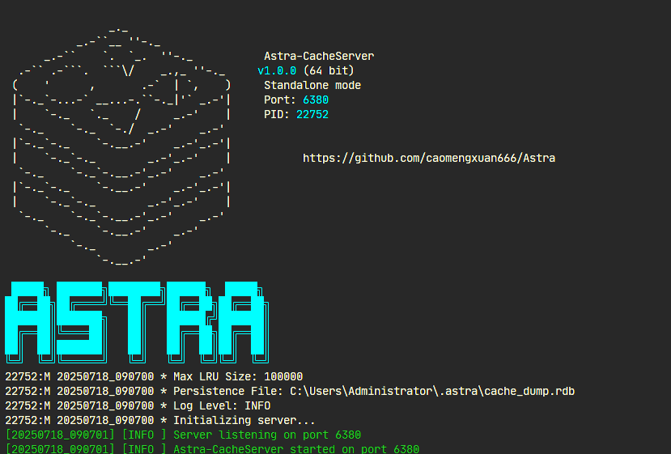

# Astra - High-performance Redis-compatible Cache Middleware

[](https://github.com/caomengxuan666/Astra)
[](https://github.com/caomengxuan666/Astra/blob/master/LICENSE)

## Project Overview
Astra is a high-performance Redis-compatible cache middleware based on C++17, featuring modular design with the following core values:
- Provides thread-safe LRU cache implementation
- Supports Redis protocol network communication
- Implements command pattern client SDK, including C++ SDK, C SDK, and LabVIEW SDK, compatible with hiredis library
- Supports TTL expiration mechanism and background cleanup
- Supports service mode startup on Windows
- Provides publish/subscribe mode and Lua script execution
- Supports RDB snapshot saving and restoration
- Supports persistence with LevelDB for high-performance data storage

## Multilingual Documentation

This documentation is available in multiple languages:

- [English README](README_en.md)
- [中文版 README](README_zh.md)

Please select your preferred language version for detailed information.

## Project Screenshots



### Project Statistics
- [Code Statistics Report](code_stats_reports/report.html) - Detailed code line count, file count, etc.
- [Interactive Charts](code_stats_reports/interactive_chart.html) - Interactive code statistics charts


### Core Modules
| Module | Function | Technical Implementation |
|-------|-------|-------|
| **Core** | Basic type definitions and macros | C++17 features
| **Utils** | Logging system/scope protection | RAII pattern
| **DataStructures** | Lock-free queue/LRU cache | CAS atomic operations
| **concurrent** | Concurrency support framework | Thread pool/task queue/task flow
| **CacheServer** | Redis protocol parsing | Asio asynchronous IO
| **Client SDK** | Command pattern encapsulation | Polymorphic design

### Supported Redis Commands

#### Key-Value Commands
- GET, SET, DEL, EXISTS, KEYS, TTL, MGET, MSET

#### Numeric Commands
- INCR, DECR

#### Connection Commands
- PING

#### Server Commands
- COMMAND, INFO

#### Publish/Subscribe Commands
- SUBSCRIBE, UNSUBSCRIBE, PUBLISH, PSUBSCRIBE, PUNSUBSCRIBE

#### Lua Script Commands
- EVAL, EVALSHA

### Concurrent Module Design
`concurrent` module provides a complete concurrency solution:

1. **ThreadPool Thread Pool**
   - Priority scheduling support (lower value first)
   - Work stealing algorithm for load balancing optimization
   - Full lifecycle management (Stop/Join/Resume)
   - Supports mixed mode of local task queues and global task queues

2. **TaskQueue Task Queue**
   - Supports task submission with callbacks
   - Provides Post/Submit interfaces
   - Implements asynchronous task scheduling based on thread pool

3. **Task Flow Orchestration**
   - **SeriesWork**: Serial task group (similar to Promise chaining)
   - **ParallelWork**: Parallel task group
   - **TaskPipeline**: Stateful task chain with shared context

```
// Example: Concurrent task orchestration
auto queue = TaskQueue::Create();

// Serial task
SeriesWork::Create(queue)
    ->Then([]{ std::cout << "Step 1"; })
    ->Then([]{ std::cout << "Step 2"; })
    ->Run();

// Parallel task
ParallelWork::Create(queue)
    ->Add([]{ /* Task A */ })
    ->Add([]{ /* Task B */ })
    ->Run();
```

## Technical Highlights
- **Six Major Technical Features**:
  - Asynchronous network model (based on Asio + custom thread pool)
  - Sharding lock mechanism to enhance concurrency performance
  - Lock-free data structures to optimize access efficiency
  - Full protocol support (Redis RESP compatible)
  - Extensible command pattern design
  - Multi-level task queue to optimize resource scheduling

## Client SDK

Astra provides client SDKs in multiple languages, making it easy for developers to integrate into their applications:

### C++ SDK
For C++ developers, it provides a complete interface to access Astra features, supporting all Redis-compatible commands.

### C SDK
For C developers, it provides C language interfaces to access Astra features, compatible with standard C language specifications.

### LabVIEW SDK
For LabVIEW developers, it provides Astra access interfaces in the LabVIEW environment, facilitating cache integration in LabVIEW.

## Windows Service Mode

Astra supports running in service mode on Windows systems, providing background persistent operation capabilities:
- Supports installation as a Windows service
- Supports starting and stopping the service
- Supports setting automatic startup
- Stable operation in service mode, supports automatic startup after system restart

## Quick Start
### Build Requirements
- C++17 compatible compiler (GCC 9+/Clang 10+)
- CMake 3.14+
- System dependencies: libfmt-dev libssl-dev

### Build Steps
```
# Clone the project
$ git clone https://github.com/caomengxuan666/Astra.git
$ cd Astra

# Build the project
$ mkdir build && cd build
$ cmake ..
$ make -j$(nproc)

# Install the project
$ sudo make install
```

### Start Service
```
# Start cache server
$ Astra-CacheServer -p 6379

# Run example client
$ ./build/bin/example_client

# Install service mode on Windows
$ Astra-CacheServer.exe install

# Start service
$ Astra-CacheServer.exe start

# Stop service
$ Astra-CacheServer.exe stop

# Set service to auto-start
$ Astra-CacheServer.exe autostart
```

## Feature Demonstration
```
#include "sdk/astra_client.hpp"

int main() {
    Astra::Client::AstraClient client("127.0.0.1", 8080);
    
    // Basic operations
    client.Set("key", "value");
    auto val = client.Get("key");
    
    // Cache with TTL
    client.Set("temp_key", "value", std::chrono::seconds(10));
    auto ttl = client.TTL("temp_key");
    
    // Atomic operations
    client.Incr("counter");
    auto count = client.Get("counter");
    
    // Batch operations
    std::vector<std::pair<std::string, std::string>> kvs = {
        {"key1", "value1"},
        {"key2", "value2"}
    };
    client.MSet(kvs);
    
    std::vector<std::string> keys = {"key1", "key2"};
    auto values = client.MGet(keys);
    
    // Publish/Subscribe
    // Subscription requires a separate client instance
    // Publish message
    client.Publish("channel", "Hello, Astra!");
}
```

## Directory Structure
```
Astra/
├── Astra-CacheServer/    # Redis-compatible cache service
│   ├── platform/         # Platform-specific code
│   │   └── windows/      # Windows service mode implementation
│   ├── sdk/              # Client SDKs (multiple language implementations)
│   └── ...               # Server core code
├── core/                 # Core type definitions
├── utils/                # Utility classes (logging/ScopeGuard)
├── concurrent/           # Concurrency support (thread pool/TaskQueue)
├── datastructures/       # Data structures (LRU/lock-free queue)
├── tests/                # GTest unit tests
├── third-party/          # Third-party dependencies (Asio/fmt)
└── benchmark/            # Performance tests

```

### Common Issues

#### Q: Why does "Failed to send response: 远程主机强迫关闭了一个现有的连接" appear?

**A:** This occurs because the client exits immediately after calling the `DEL` method, causing the server's message to be considered "lost," as 'DEL' itself returns 'OK'. However, this does not affect the program's normal operation. The client does not need to block indefinitely to wait for the server to confirm the successful deletion of data. Normally, the delete operation will not fail.

## Contribution Guide
Please refer to [CONTRIBUTING.md](CONTRIBUTING.md) for the complete contribution guide, including code style, submission requirements, and review process.

## Issue Reporting
Please submit bug reports or feature requests through [GitHub Issues](https://github.com/caomengxuan666/Astra/issues)

## License
This project is licensed under the MIT License - see [LICENSE](LICENSE) file
