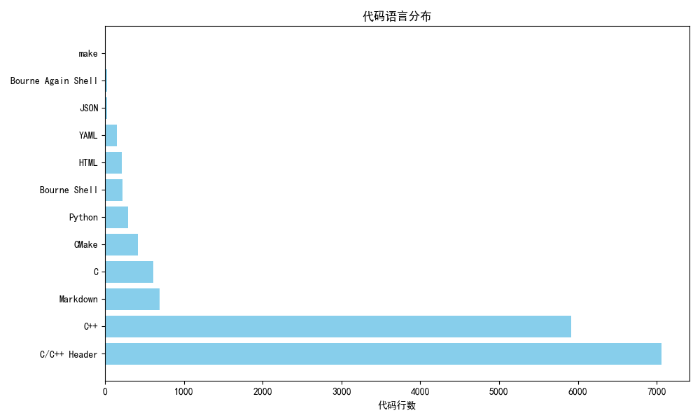

# Astra - High-performance Redis-compatible Cache Middleware

[](https://github.com/caomengxuan666/Astra)
[](https://github.com/caomengxuan666/Astra/blob/master/LICENSE)

## Project Overview
Astra is a high-performance Redis-compatible cache middleware based on C++17, featuring modular design with the following core values:
- Provides thread-safe LRU cache implementation
- Supports Redis protocol network communication
- Implements command pattern client SDK, including C++ SDK, C SDK, and LabVIEW SDK, compatible with hiredis library
- Supports TTL expiration mechanism and background cleanup
- Supports service mode startup on Windows
- Provides publish/subscribe mode and Lua script execution
- Supports RDB snapshot saving and restoration

## Project Screenshots


### Project Statistics
- [Code Statistics Report](code_stats_reports/report.html) - Detailed statistics on lines of code, number of files, etc.
- [Interactive Chart](code_stats_reports/interactive_chart.html) - Interactive code statistics chart


### Core Modules
| Module | Function | Technical Implementation |
|-------|-------|-------|
| **Core** | Basic type definitions and macros | C++17 features
| **Utils** | Logging system/ScopeGuard | RAII pattern
| **DataStructures** | Lock-free queue/LRU cache | CAS atomic operations
| **concurrent** | Concurrency support framework | Thread pool/Task queue/Task flow
| **CacheServer** | Redis protocol parsing | Asio asynchronous IO
| **Client SDK** | Command pattern encapsulation | Polymorphic design

### Supported Redis Commands

#### Key-Value Commands
- GET, SET, DEL, EXISTS, KEYS, TTL, MGET, MSET, MDEL, RENAME, RENAMENX, EXPIRE, PEXPIRE, EXPIREAT, PEXPIREAT, PERSIST, GETEX, GETSET, SETEX, SETNX, APPEND, BITCOUNT, DECRBY, INCRBY, INCRBYFLOAT, STRLEN, SUBSTR, SETRANGE, GETRANGE

#### Numeric Commands
- INCR, DECR, INCRBY, DECRBY, INCRBYFLOAT

#### Connection Commands
- PING, ECHO, SELECT, AUTH, QUIT

#### Server Commands
- COMMAND, INFO, CONFIG, CLIENT, SLOWLOG, TIME, DBSIZE, FLUSHDB, FLUSHALL, MONITOR, SLEEP, REFCOUNT, ENCODING, IDLETIME

#### Publish/Subscribe Commands
- SUBSCRIBE, UNSUBSCRIBE, PUBLISH, PSUBSCRIBE, PUNSUBSCRIBE, PUBSUB, SPUBLISH

#### Lua Script Commands
- EVAL, EVALSHA, SCRIPT

#### Hash Commands
- HDEL, HEXISTS, HGET, HGETALL, HKEYS, HLEN, HSET, HVALS

#### List Commands
- LINDEX, LLEN, LPOP, LPUSH, LRANGE, RPOP, RPUSH

#### Set Commands
- SADD, SCARD, SISMEMBER, SMEMBERS, SPOP, SREM

#### Sorted Set Commands
- ZADD, ZCARD, ZRANGE, ZRANGEBYSCORE, ZREM, ZSCORE

### Concurrent Module Design
The `concurrent` module provides a complete concurrency solution:

1. **ThreadPool**
   - Priority scheduling support (smaller values first)
   - Work-stealing algorithm for load balancing optimization
   - Complete lifecycle management (Stop/Join/Resume)
   - Support for hybrid mode of local task queues and global task queues

2. **TaskQueue**
   - Support for task submission with callbacks
   - Provides Post/Submit interfaces
   - Asynchronous task scheduling based on thread pool

3. **Task Flow Orchestration**
   - **SeriesWork**: Serial task group (similar to Promise chain calls)
   - **ParallelWork**: Parallel task group
   - **TaskPipeline**: Stateful task chain with shared context

```cpp
// Example: Concurrent task orchestration
auto queue = TaskQueue::Create();

// Serial tasks
SeriesWork::Create(queue)
    ->Then([]{ std::cout << "Step 1"; })
    ->Then([]{ std::cout << "Step 2"; })
    ->Run();

// Parallel tasks
ParallelWork::Create(queue)
    ->Add([]{ /* Task A */ })
    ->Add([]{ /* Task B */ })
    ->Run();
```

## Technical Highlights
- **Six Technical Features**:
  - Asynchronous network model (based on Asio + custom thread pool)
  - Sharded lock mechanism to improve concurrent performance
  - Lock-free data structures to optimize access efficiency
  - Complete protocol support (Redis RESP compatible)
  - Extensible command pattern design
  - Multi-level task queue to optimize resource scheduling

## Client SDK

Astra provides client SDKs in multiple languages for easy integration into your applications:

### C++ SDK
For C++ developers, provides complete Astra functionality access interface, supporting all Redis-compatible commands.

### C SDK
For C developers, provides C language interface to access Astra functionality, compatible with standard C language specifications.

### LabVIEW SDK
For LabVIEW developers, provides Astra access interface in LabVIEW environment, facilitating cache integration in LabVIEW.

## Windows Service Mode

Astra supports running in service mode on Windows systems, providing background persistent running capability:
- Supports installation as Windows service
- Supports starting and stopping services
- Supports setting automatic startup
- Stable operation in service mode, supports automatic startup after system reboot

## Quick Start
### Build Requirements
- C++17 compatible compiler (GCC 9+/Clang 10+)
- CMake 3.14+
- System dependencies: libfmt-dev libssl-dev

### Build Steps
```bash
# Clone project
$ git clone https://github.com/caomengxuan666/Astra.git
$ cd Astra

# Build project
$ mkdir build && cd build
$ cmake ..
$ make -j$(nproc)

# Install project
$ sudo make install
```

### Start Service
```bash
# Start cache server
$ Astra-CacheServer -p 6379

# Run example client
$ ./build/bin/example_client

# Install service mode on Windows
$ Astra-CacheServer.exe install

# Start service
$ Astra-CacheServer.exe start

# Stop service
$ Astra-CacheServer.exe stop

# Set service to auto-start
$ Astra-CacheServer.exe autostart
```

## Feature Demonstration
```cpp
#include "sdk/astra_client.hpp"

int main() {
    Astra::Client::AstraClient client("127.0.0.1", 8080);
    
    // Basic operations
    client.Set("key", "value");
    auto val = client.Get("key");
    
    // Cache with TTL
    client.Set("temp_key", "value", std::chrono::seconds(10));
    auto ttl = client.TTL("temp_key");
    
    // Atomic operations
    client.Incr("counter");
    auto count = client.Get("counter");
    
    // Batch operations
    std::vector<std::pair<std::string, std::string>> kvs = {
        {"key1", "value1"},
        {"key2", "value2"}
    };
    client.MSet(kvs);
    
    std::vector<std::string> keys = {"key1", "key2"};
    auto values = client.MGet(keys);
    
    // Publish/Subscribe
    // Subscription requires a separate client instance
    // Publish message
    client.Publish("channel", "Hello, Astra!");
    
    // Hash operations
    client.HSet("user:1000", "name", "Alice");
    client.HSet("user:1000", "email", "alice@example.com");
    auto name = client.HGet("user:1000", "name");
    
    // List operations
    client.LPush("tasks", "task1");
    client.LPush("tasks", "task2");
    auto len = client.LLen("tasks");
    
    // Set operations
    client.SAdd("tags", "redis");
    client.SAdd("tags", "cpp");
    client.SAdd("tags", "database");
    auto members = client.SMembers("tags");
    
    // Sorted set operations
    client.ZAdd("scores", "Alice", 95.5);
    client.ZAdd("scores", "Bob", 87.2);
    auto range = client.ZRange("scores", 0, -1);
}
```

## Directory Structure
```
Astra/
├── Astra-CacheServer/    # Redis-compatible cache service
│   ├── platform/         # Platform-specific code
│   │   └── windows/      # Windows service mode implementation
│   ├── sdk/              # Client SDK (multi-language implementation)
│   └── ...               # Server core code
├── core/                 # Core type definitions
├── utils/                # Utility classes (logging/ScopeGuard)
├── concurrent/           # Concurrency support (thread pool/TaskQueue)
├── datastructures/       # Data structures (LRU/lock-free queue)
├── tests/                # GTest unit tests
├── third-party/          # Third-party dependencies (Asio/fmt)
└── benchmark/            # Performance tests

```

### Frequently Asked Questions

#### Q: Why does "Failed to send response: The remote host forcibly closed an existing connection" occur?

**A:** This happens because the client exits immediately after calling the `DEL` method, causing the message sent by the server to be considered "lost" since 'DEL' itself returns an 'OK'. However, this does not affect the normal operation of the program. The client itself does not need to block continuously to wait for the server to confirm the successful deletion of data. Deletion operations normally do not fail.

## Contribution Guidelines
Please refer to [CONTRIBUTING.md](CONTRIBUTING.md) for complete contribution guidelines, including code specifications, submission requirements, and review processes.

## Issue Reporting
Please submit bug reports or feature requests through [GitHub Issues](https://github.com/caomengxuan666/Astra/issues)

## License
This project is licensed under the MIT License - see the [LICENSE](LICENSE) file for details